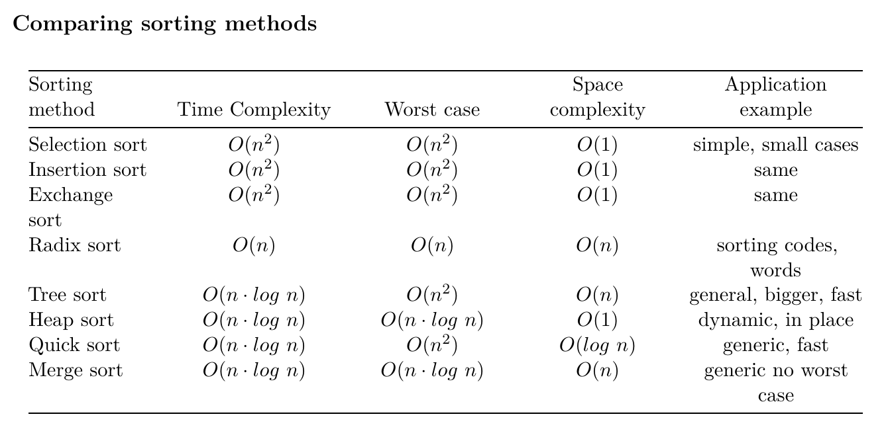

# Sorting Algorithms
- Idea
    - Compare 2 values from collection
    - If not in order, then exchange them (key comparison and placement)
- Exchange is expensive, total number of exchanges indicate sorting algorithm efficiency.

<!-- -->

## Bubble Sort
- List element “bubbles” to the position in the list where it belongs.
- Algorithm (List C[] with n elements) -
    1) Compare C[0] and C[1]
        - If C[0] < C[1], leave unchanged
        - If C[0] > C[1], swap values
    2) Repeat above step until end of list
    3) Repeat 1), 2) n times
- For each loop variable i, there are n-i comparisons performed. 
    - O(n) operations on n elements
    - This gives O(n^2) time complexity
- O(1) space complexity

## Selection Sort
- Algorithm (ListC[] with n elements) -
    - Run iteration for i from 1 to n:
        - For all consecutive elements from position i, Find Smallest Element index min_i
        - Swap first element (C[i]) with C[min_i]
- n comparisons made for each of the n time steps
    - O(n^2) Time Complexity
- O(1) Space Complexity

## Insertion Sort
- Algorithm (List C[] with n elements) -
    - Run iteration for i from 1 to n:
        - Compare current element (key=C[i]) with predecessor
        - If key element smaller, compare with elements before
            - Move greater elements one position up, to make space for swapped element
- Worst Case - Inverted list. Every ith postion to be shifted to 1
    - O(n^2)
- O(1) Space Complexity

## Binary Insertion Sort
- In the comparison step, the location/index of the element to be swapped is found using binary search
- Doubt it algorithm -> **Why does the high_idx <= low_idx case work?**
- Time complexity is 
    - T(Comparison) + T(Swapping)
    - O(nlogn) + O(n^2)
    - This is equaivalent to O(n^2) itself
- Space complexity -
    - O(1)

## Exchange Sort
- Similiar to Selection Sort
- Instead of finding the minimum index over the sub array (as in selection sort), keep exchanging the elements of the sub array.
- Time Complexity -
    - O(n^2)
- Space Complexity -
    - O(1)

## Counting Sort
- Works well when the range of values in the array is small.
- Algorithm (List C[] with n elements) (https://www.youtube.com/watch?v=0B33As8jPgo) -
    - Determine the number range
    - Create empty index array/count array/size array
    - Fill count array with number of occurences in C[]
    - Sum up predecessor values
    - Create empty output array
    - Start the input-index-output array Mapping
        - Whenever input number is entered to the output array, decrement the corresponding number in the index array.
- n is the number of elements in the array to be sorted. 
- k is the range of the elements which is required to form the COUNT array
- Time Complexity -
    - O(n+k)
- Space Complexity -
    - O(n+k)
