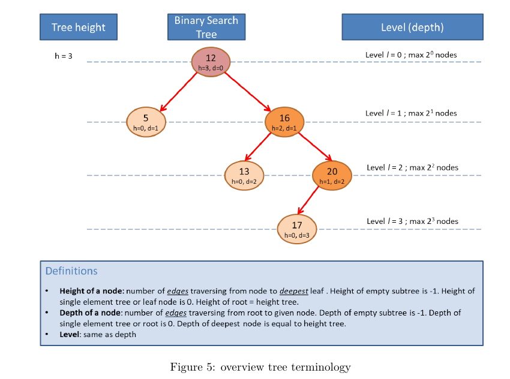

# Trees

## Imp Terms
- Node height
    - Count of edges (arcs) between a node and its furthest leaf node.
    - Node height of root is known as tree height
- Node Depth
    - Node Depth is number of edges in the path from root to the node

- Binary Search Tree (BST)
    - The child node on the right is always greater than its parent

- Python Implementation
    - Contiguous memory - 
        - LET (List-embedded tree)
        - as a heap
    - Dynamic allocation heap memory
        - Class TreeNode with Linked recursive data structure
- Dynamic allocation heap memory
    - Delete/Remove a node (3 cases):
        - Leaf Node - Straighforward to delete
        - Node with one child - Replace node with only child
        - Node with two children 
            - Replace node with minimum value in right sub-tree (Successor Node)
        - Time Complexity -
            - O(h), where h is the height of the BST

- Tree Traversal -
    - Depth First Traversal (DFS)
        - Inorder (Left, Root, Right) - Gives a non-decreasing order, O(n) Time Complexity, O(height of tree) Space Complexity in terms of stack size
        - Preorder (Root, Left, Right)
        - Postorder (Left, Right, Root)

